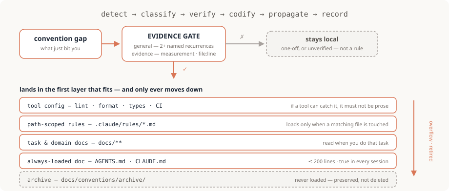
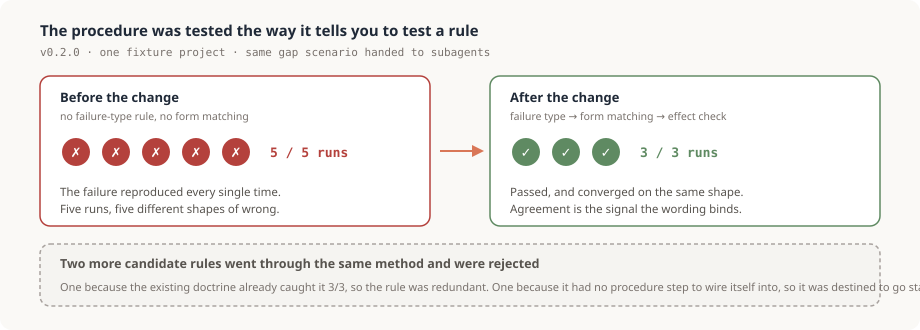
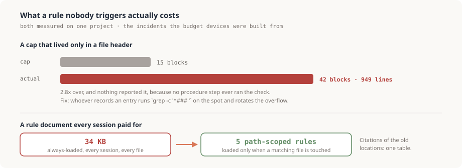

# self-improvement — conventions that fix themselves

<div align="right">
  <a href="README.ko.md"></a>
  <a href="README.md"></a>
  <a href="LICENSE"></a>
</div>

A Claude Code plugin that turns "I just got bitten by a missing or wrong convention" into a fix of **the convention itself**, inside the same unit of work — instead of a workaround that only helps the file you happened to be in.

It is stack-agnostic. Frontend, backend, scripts, docs — the loop knows nothing about your domain, and the shape of your project's documentation is detected at setup time rather than assumed.

> **Language note.** The doctrine, skills, and agent are written in English as of v0.5.0. Claude reads and follows them regardless of the language you work in, and the conventions it writes into your project take on the voice and language of the document they land in. If you installed v0.4.0 or earlier, the source text was Korean; see the upgrade note below.

Three principles:

1. **Conventions are not frozen.** The session that hits the gap fixes it, in the same unit of work, without waiting to be asked.
2. **No evidence, no rule.** A gap is codified only if it is *general* (you can name two or more places it recurs) **and** *evidenced* (a measurement, a log, a `file:line`). Otherwise it stays local, or it waits for verification.
3. **Documents have a budget.** Rules go in the narrowest scope that covers them, and when a document overflows, the overflow is demoted or archived. A rule doc that grows forever is a rule doc nobody reads.

## Install

```
/plugin marketplace add sh5623/self-improvement
/plugin install self-improvement@self-improvement
/reload-plugins
```

> Also using [fe-rail](https://github.com/sh5623/fe-rail)? Install both from one marketplace: [`sh5623/guardrail`](https://github.com/sh5623/guardrail).

Installs at **user scope** by default, so it applies to every session in every project. Use `--scope project` to limit it to one repo, or drop it from that project's `.claude/settings.json` → `enabledPlugins` to turn it off. Update with `/plugin marketplace update self-improvement` → `/reload-plugins` → then **re-run `/self-improvement:si-init`** in projects you had already set up: an update replaces the tool but not the data file, so the file keeps whatever wording the older template gave it. The re-run compares a version stamp and repairs that wording only — your routing values, index, and log are left alone.



## What it looks like

You don't invoke anything. You are working on something else, and the session stops to fix the rule on its way out:

```
$ claude
> the transferStock partial-commit bug — please fix it

  ✔ src/orders/OrderService.java:88 — the second repository write was running
    outside the transaction boundary.

  Before finishing — does this recur anywhere else?
    · PaymentService.java:141, SettlementService.java:52 — same shape (grep)
    · evidence: production log + file:line          → gate passed
    · a linter can enforce this, so it is not prose → tool config layer

  + src/test/java/arch/TransactionBoundaryTest.java   ArchUnit rule
  + docs/conventions/CHANGELOG.md                     index row + log block

self-improvement: 1 item — ArchUnit rule (tool config layer) + changelog
```

That last line, *self-improvement: 1 item*, is the observable signal. The doctrine specifies it as a literal marker, so you get it verbatim whatever language you work in. **If it is missing, the end-of-work check was skipped**, and you can ask for it. A project that already declared its own marker string keeps it: the requirement is the line, not the language.

## What you get

| Component | Role |
|---|---|
| **SessionStart hook** (`hooks/doctrine.md`) | Injects a 6-clause doctrine into **every session** — fix the rule, not just your file · the evidence gate · the end-of-work self-check · the reporting duty. It is re-injected after a compaction, so long sessions don't lose it. |
| `/self-improvement:si-improve` | The protocol itself: detect → classify → verify → codify → propagate → record. |
| `/self-improvement:si-init` | Per-project bootstrap (idempotent): detect the documentation landscape → create the data file → wire a 3-line pointer into the always-loaded doc — including when it registers a system you already had, so the next session inherits the paths instead of re-deriving them. Re-run it after a plugin update to repair version drift. |
| `/self-improvement:si-archive` | Bloat and dead-rule migration: measure against budgets → demote / merge / retire → migration table → changelog rotation. |
| `convention-smith` agent | Delegate here when routing or drafting is unclear. READ + DRAFT only — it returns a gate verdict and a minimal diff; the caller applies it. |

**Tool vs. data.** The plugin is the versioned *tool*. What lands in your project is **one data file** (`docs/conventions/CHANGELOG.md` — routing table, budgets, migration table, index, log) plus three lines of pointer. Updating the plugin never touches the history your project has accumulated — which is also why the data file carries a version stamp: the boilerplate it was generated from can fall behind the procedure, and `si-init` reconciles exactly that, nothing else.

## How it works

### Rules live in layers, and only move downward

A new rule goes into **the first layer from the top that fits** (`si-improve` §4). When a layer overflows or a rule dies, it moves **down only** (`si-archive`).

| Layer | When it loads | Notes |
|---|---|---|
| Tool config (lint · format · types · tests · CI) | Enforced automatically | If a tool can catch it, **it must not be prose**. Prose rules carry judgment calls only. |
| Path-scoped rules (`.claude/rules/*.md` with `paths:`) | Only when a matching file is touched | The default home. A new file means zero conflicts for parallel work. |
| Task / domain docs (`docs/**`) | Read explicitly when doing that task | Playbooks, specs. |
| Always-loaded doc (`AGENTS.md` / `CLAUDE.md`) | Every session | **≤200 lines.** Only what is true in every session, for every file. |
| Archive (`docs/conventions/archive/`) | Never loaded | Retired rules and rotated log entries. Preserved, not deleted — so "deliberately removed" stays distinguishable from "lost". |

### Three devices keep it from bloating

- **Log rotation** — the changelog holds at most 15 body blocks. Whoever records an entry checks it on the spot (`grep -c '^### '`) and rotates the overflow into the archive. The index and migration tables stay in the head file for the full history, which is what makes duplicate-checking a single-file scan.
- **Migration table** — one row per demotion or retirement. Old citations resolve through that one table instead of scattering pointers across the documents they left.
- **Caps are wired into the procedure that executes them** — never only into a document header. This one is not theoretical: a cap that lived only in a file header went untriggered until that log had grown to 42 blocks and 949 lines.

## Quick start

```
# 1) Once per project. If a similar system already exists, it registers that one and stops —
#    it does not overwrite what you already have.
/self-improvement:si-init

# 2) When a convention bites you (or when the doctrine makes the session do it unprompted)
/self-improvement:si-improve  <what bit you + the evidence>

# 3) When the rule docs have grown
/self-improvement:si-archive
```

From then on, every work report should end with **`self-improvement: N items + where`** or **`self-improvement: none`**. That line is the signal that the loop ran. If your project declared its own marker string before v0.5.0, keep it: the requirement is the line, not the language.

> **What is and isn't guaranteed.** The hook injection is deterministic — the doctrine is in context, every session. What follows is instruction-following, not enforcement: nothing blocks a session that ignores it. That is exactly why the reporting line exists. If the line is missing, the end-of-work self-check was skipped, and you can ask for it.
>
> A `Stop` hook could block on the missing line, and deliberately does not. `Stop` fires at the end of *every* response, and cannot tell the end of a unit of work from a turn in the middle of one — demanding the line on each intermediate turn mass-produces "none applicable" and kills the signal it was meant to carry. To harden it for one project, wire the line into that project's completion checklist instead (si-improve §5).

## Does it work

Two kinds of evidence exist for this plugin, and they answer different questions. Neither of them is
"teams using this ship fewer bugs", because that measurement does not exist and inventing it would
break the plugin's own evidence gate.

### Does the procedure change behavior?

When v0.2.0 added three rules (classify the failure type, match the form to it, verify the wording
before committing), those rules were tested the way `si-improve` §4 tells you to test a rule: the
same gap scenario, handed to subagents in an isolated fixture project, with and without the change.



The convergence is the part that matters. Five runs producing five different shapes means the wording
was not binding; three runs agreeing means it was. Two further candidate rules went through the same
method and **did not survive it**, which is the more useful result: one was redundant because the
existing doctrine already caught the case 3/3, and one had no procedure step to wire itself into, so
it would have gone stale exactly like the header-only cap below.

### What does the absence of these devices cost?

The budget model, the log rotation, and the migration table are not design preferences. Each one is
the response to a measured incident on the project this was generalized from.



Two more from the same project, both about wording rather than size:

| Incident | Measured | The device it produced |
|---|---|---|
| An unconditional assertion in a detection rule | **13 correct cases** flagged as defects | No unconditional assertions; grep for a counterexample before writing the rule |
| The record unit was "one improvement", so a day producing eight of them | **21 index rows, 0 bodies** | One unit of work = one log block; the body carries what the landing doc cannot |

### Was the plugin's own text checked?

v0.4.0 came from a cross-model review that filed four defects with file and line. Each was reproduced
against fixtures before it was accepted, and **two of the four proposed fixes were rejected by that
check**.

| Claim under test | Fixtures | Result |
|---|---|---|
| A README can pass as a data-file candidate | This plugin's README, the template, an index-less changelog, a plain README | Judging grep: **0 / 4 / 1 / 0** hits, so describe-only docs are excluded |
| A strict regex for "is `@AGENTS.md` imported" | 3 `CLAUDE.md` variants: bare, backticked, bare-after-code-span | Strict regex **1/3 wrong**; plain grep plus a stated rule **3/3** |

### How to read these numbers

**All of it comes from one project and one fixture set.** The origin project logged roughly forty
convention changes over a legacy migration plus API integration work, and every number above traces
to that history or to a fixture built from it. They are published so you can see what the devices are
for and how they were checked, not as figures to expect in your own repo. If you run this and measure
something different, that is a contribution: open an issue.

## Where it came from

This is not a design exercise. It generalizes rules that were paid for on a real project (a legacy migration plus API integration work, with roughly forty logged convention changes). Each row below is an actual incident and the rule it produced.

| What went wrong | The rule it produced |
|---|---|
| Convention repair was treated as a separate task the user had to request, so most of it was never done | Self-initiated + a reporting duty — a report without that line means the self-check was skipped |
| A size cap existed only in a file header, so nothing ever triggered it; the log reached 42 blocks / 949 lines | A rule must be wired into the procedure step that executes it |
| An unconditional assertion ("the total is always 100") flagged 13 correct cases as defects | No unconditional assertions — state the conditions and exceptions, and grep for counterexamples before writing the rule |
| Narrowing a rule's scope to "our case only" missed a counterexample in another area | Narrowing a scope needs evidence too, not just widening it |
| A performance verdict read off a warmed cache was published, then retracted the same day | Measure cold; a warmed number is a floor, not the truth — and apply the same standard to "we fixed it" from the other side |
| An always-loaded rule doc reached 34 KB and was paid for on every single session | The layer model, scope demotion, and the migration table |
| Rules were written and never checked, so wording that declared a thing but changed no behavior survived | Verify the wording before you commit to it — re-judge the violations you just measured, and for costly rules run a control with no rule at all |
| Behavioral instructions carried an inline "unless…" clause, which turned the rule into something to negotiate with | Scope by structure, put a genuine exception on its own line as a condition |
| A prohibition was written for a failure where the output had the wrong shape, which is the form that backfires there | Classify the failure type first, then match the form to it |
| The record unit was "one improvement", so a day that produced eight of them ended with 21 index rows and no body at all — each block looked like a duplicate of the doc it had just landed in | One unit of work = one log block holding N improvements; one improvement = one index row. The body carries what the landing doc cannot: the trigger, the evidence, the verification |
| An existing convention system was "registered" by reporting its location, which died with the session; the next session re-ran the same fallback grep, whose first hit was a README and whose third was an archive file | Registration writes the real paths into the always-loaded doc, and the lookup reads that declaration first — then falls back to a grep that requires an index table and excludes archives |
| After a plugin update the data file still declared the older template's rules, and nothing could tell | A version stamp in the data file plus an `si-init` re-run that reconciles it — generated files get their boilerplate repaired, pre-existing systems get a contradiction report and nothing more |
| §0 resolved the data file's path, then every command after it typed the default path anyway — on a project whose existing system lives elsewhere, the duplicate check and the rotation count read a file that isn't there, and a grep over a missing file returns zero hits and passes quietly | Resolve the path once in §0 and substitute `<데이터파일>` / `<아카이브>` in every command after it, with an `ls` to prove the file exists |
| The pointer was written into `AGENTS.md` alone, but Claude Code reads `CLAUDE.md`, not `AGENTS.md` — so the pointer never loaded and the next session fell back to grepping | Writing to `AGENTS.md` also guarantees the `@AGENTS.md` import in `CLAUDE.md` (or a symlink), in the same step, and the report states which path actually loads |
| The existing-system probe returned a README that merely contained the words "self-improvement", with nothing to judge it by — registering it would have ended setup with no data file at all | Judge candidates by content in two tiers — an index/routing table or version stamp first, then a file that actually holds records — and exclude describe-only docs and archives |

The last three rows came from a cross-model review of this plugin itself, not from the field; each was reproduced against fixtures before it was accepted.

## Upgrading from 0.4.x

v0.5.0 switched the doctrine, skills, and agent from Korean to English. Nothing about the procedure
changed, and **your project's data file is untouched**, because it is project data and this plugin
never rewrites it.

Two things to know:

1. **The report marker is now `self-improvement: N items`.** Earlier versions specified the Korean
   string. If your always-loaded doc or checklists reference the old marker, either update them or
   keep them: a project that has declared its own marker string keeps it, since the requirement is
   the line, not the language. What is not fine is having both declared and no statement of which
   one wins.
2. **Run `/self-improvement:si-init` once after updating.** It compares the version stamp in your
   data file against the plugin and repairs stale template wording, leaving your routing table,
   index, log, and migration table exactly as they are. Data files registered from a pre-existing
   system carry no stamp and are never auto-edited; init only reports contradictions.

Detection still recognizes installations that wrote the Korean term into their always-loaded docs,
so an older project is found and registered rather than duplicated.

## Prerequisites

Claude Code. That is the whole list — there is no build step, no runtime, and no dependency to install. The plugin is Markdown plus two JSON manifests, and the one data file it creates in your project is Markdown too.

## This plugin is subject to its own loop

If a skill, the doctrine, or the agent falls short, it gets fixed the same way — edit this repo and bump `version` in `.claude-plugin/plugin.json`. The meta-conventions aren't frozen either.

**When the procedure changes, the procedure gets tested.** The three rules added in v0.2.0 (failure type, form matching, effect verification) are the worked example. An isolated fixture project got the same gap scenario, handed to subagents: **five runs before the change reproduced the failure every time, three runs after it passed and converged on the same shape.** Two other candidates were measured the same way and **rejected** — one because the existing doctrine already caught it 3/3, the other because it had no procedure step to wire itself into and so was destined to go stale. A document that demands you verify a rule's wording has no standing if it never verified its own.

v0.3.0 arrived from the opposite direction: the project this was generalized from pushed back while adopting v0.2.0, and each claim was reproduced in a fixture before it was accepted. The fallback lookup really did rank a README first and an archive file above the real one; the old record unit really did produce an index with no body behind it.

v0.4.0 came from a third direction — a different model reviewed the plugin's own text and filed four defects with file and line. Every one was checked before it was accepted, and two of the proposed fixes did not survive the check. Gating existing-system candidates on having an index table would have dropped a legitimate convention log that simply never had one, so the judgment became two-tiered. The strict regex for "is `@AGENTS.md` actually imported" missed a bare import that followed an inline code span, so it became a plain grep plus a stated rule about backticks. The fourth report asked for a `Stop` hook and got a reasoned refusal instead, recorded above under [Quick start](#quick-start): a rule you cannot observe the trigger for is worse than no rule.

The form-matching table and the no-rule control come from the `writing-skills` meta-skill in [obra/superpowers](https://github.com/obra/superpowers), which applies TDD to skill authoring — baseline under pressure, minimal write, close the loopholes. Its head-to-head wording tests showed that prohibitions backfire on wrong-shape failures and that a single exception clause degrades compliance from consistent to noisy; the five baseline runs above reproduced both failures inside this procedure.

Issues and PRs welcome — see [CONTRIBUTING](.github/CONTRIBUTING.md) for how changes here are tested, and [CODE_OF_CONDUCT](.github/CODE_OF_CONDUCT.md).

## License

[MIT](LICENSE) © 2026 Seungho
